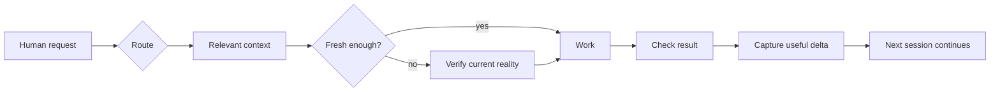

<div align="center">

# AI Continuity Kit

### Give ChatGPT and Codex continuity — without letting old memory become false truth.

**A lightweight, Git-backed layer for AI memory, context engineering, personal knowledge, and long-running projects.**

[⚡ 5-minute start](docs/QUICKSTART.md) · [🧠 See the model](docs/CORE_MODEL.md) · [💡 Use cases](docs/USE_CASES.md) · [⚖️ Compare approaches](docs/COMPARISON.md) · [🇷🇺 Русский](README.ru.md)


</div>

---

## The problem in 20 seconds

You use ChatGPT or Codex for weeks or months. Then one of these happens:

- the assistant **forgets an important decision**;
- it remembers something that **used to be true but is stale now**;
- the project is scattered across chats, notes, files, and agent memory;
- a new session has to **reconstruct everything from scratch**;
- an agent has technical access, but nobody clearly defined **what it is actually allowed to change**.

AI Continuity Kit gives you a small, inspectable continuity layer so the AI can answer three questions before acting:

> **What do we know? What is current? What am I allowed to do?**

No vector database. No background service. No agent framework. Start with plain Markdown and Git.

---

## What changes for you

| Before | With AI Continuity Kit |
|---|---|
| “I think we discussed this somewhere.” | Decisions have an explicit home. |
| Old chat memory quietly becomes “truth.” | Mutable facts can require a freshness check. |
| Every new session gets a giant context dump. | The assistant loads only the relevant route. |
| Projects live inside conversation history. | Current state survives the conversation. |
| Useful lessons are mixed with current facts. | Memory and verified facts are separate. |
| Broad agent access feels like broad permission. | Technical access and authorization are separate. |

The goal is not more documentation. The goal is **less reconstruction, less stale context, and safer continuation**.

---

## See it in one example

Imagine a project originally used Provider A. Two months later you migrated to Provider B.

A normal memory system may still surface “Provider A” because it was once important.

With this model:

```text
PROJECT_STATE.md   → migration complete; Provider B is current
PROJECT_FACTS.md   → Provider B, last verified 2026-08-16
PROJECT_MEMORY.md  → Provider A caused a useful past failure pattern
EVIDENCE/          → dated proof of the migration test
```

The old information is not deleted. It is simply **not allowed to impersonate current reality**.

That distinction is the core of the project.

---

## Try it in 5 minutes

The ready-to-copy template is in [`starter/`](starter/).

### 1. Copy the starter into a private repository

Your real personal context should normally be private.

### 2. Fill only three small things

- `context/PREFERENCES.md` — how you prefer to work;
- `context/FACTS.md` — durable facts worth reusing;
- one project `STATE.md` — only if you actually have a continuing project.

### 3. Paste one instruction to your AI

Use [`starter/BOOTSTRAP_PROMPT.md`](starter/BOOTSTRAP_PROMPT.md), or simply say:

> Start with `START.md`. Load only the context needed for my request. Treat mutable facts as stale when freshness matters. After substantial work, save only reusable confirmed delta.

Then ask something normal, for example:

> “What is the current state of my project and what should I do next?”

You do **not** need to memorize the file structure. The structure exists so the assistant can be more reliable.

Full walkthrough: [5-minute quick start](docs/QUICKSTART.md).

---

## The continuity loop



**Core rule:**

```text
ROUTE → OWNER → FRESHNESS CHECK → WORK → VERIFY → CAPTURE DELTA
```

---

## Six ideas that make it different

1. **Memory is not truth.** A useful lesson can survive for years; a server address may be stale tomorrow.
2. **One fact, one owner.** Avoid several files independently claiming the same current state.
3. **Progressive disclosure.** Load only the context needed for the current task.
4. **Keep deltas, not transcripts.** Save decisions, verified state, blockers, and lessons — not conversational noise.
5. **Human language first.** The user asks normal questions; the assistant handles routing.
6. **Technical access is not permission.** An agent having write access does not mean every write is authorized.

---

## Three levels — start small

| Level | Best for | Add |
|---|---|---|
| **Lite** | Everyday ChatGPT use | preferences, durable facts, memory rules |
| **Standard** | Personal/work projects | state, facts, decisions, memory, dated evidence |
| **Advanced** | Codex / agents / operations | action gates, permissions, recovery, CI, multiple repositories |

**Do not start with Advanced.** Add structure only when a real recurring problem justifies it.

---

## Is this another “second brain”?

Not exactly.

A second brain usually focuses on **collecting and retrieving knowledge**. AI Continuity Kit focuses on **continuing work without confusing memory, history, plans, and current truth**.

It can complement:

- ChatGPT Memory;
- Codex project instructions;
- an Obsidian vault;
- a RAG/vector database;
- a personal AI assistant;
- an existing project repository.

See [Comparison: native memory vs second brain vs RAG vs continuity layer](docs/COMPARISON.md).

---

## Good use cases

- keeping ChatGPT preferences without turning them into a biography dump;
- continuing a project across many conversations;
- keeping current facts separate from historical evidence;
- handing work between ChatGPT and Codex;
- preserving decisions and the reason behind them;
- remembering useful failure/recovery patterns;
- controlling what an agent may change when it has broad technical access.

See [realistic examples](docs/USE_CASES.md).

---

## Privacy and safety

This repository is a **public template**. Your actual continuity repository should usually be **private**.

Never commit real passwords, tokens, private keys, cookies, session state, `.env` values, or secret-bearing configuration. Keep a safe pointer or variable name instead.

Also remember: a dated test proves what was true **at that time**. It does not automatically prove current runtime state.

Read [`SECURITY.md`](SECURITY.md).

---

## Who this is for

This project is useful if you think:

- “I want my AI to remember, but I also want to know **why I should trust what it remembers**.”
- “I keep rebuilding project context in new chats.”
- “I want ChatGPT and Codex to share a durable working model without stuffing everything into every prompt.”
- “I want something inspectable and editable by a human.”

It is probably **not** for you if you only need casual chat, or if you already have a mature knowledge/agent platform that solves freshness, ownership, continuity, and permissions well enough.

---

## What this project is not

- Not a replacement for ChatGPT Memory.
- Not a replacement for Codex project instructions.
- Not a vector database or RAG engine.
- Not a transcript archive.
- Not a claim that Markdown is always the right database.
- Not an excuse to turn everyday life into process bureaucracy.

The smallest useful system wins.

---

## Explore

- [Quick start](docs/QUICKSTART.md)
- [Core model](docs/CORE_MODEL.md)
- [Architecture](docs/ARCHITECTURE.md)
- [Use cases](docs/USE_CASES.md)
- [Comparison](docs/COMPARISON.md)
- [FAQ](docs/FAQ.md)
- [Examples](examples/README.md)
- [Roadmap](ROADMAP.md)
- [Starter template](starter/)

---

## Project status

**v0.2 preview.** The model is intentionally lightweight while real-world workflows are validated.

The next goal is not “more files.” It is a smoother path from:

```text
I just found this repo
        ↓
I understand why I need it
        ↓
I get my first useful result
        ↓
I keep using it because it reduces friction
```

Contributions and real-world failure cases are welcome. See [`CONTRIBUTING.md`](CONTRIBUTING.md).

## Independent project

AI Continuity Kit is an independent open-source project. It is not affiliated with or endorsed by OpenAI. “ChatGPT” and “Codex” are used descriptively to explain compatible workflows.

## License

MIT — see [`LICENSE`](LICENSE).
