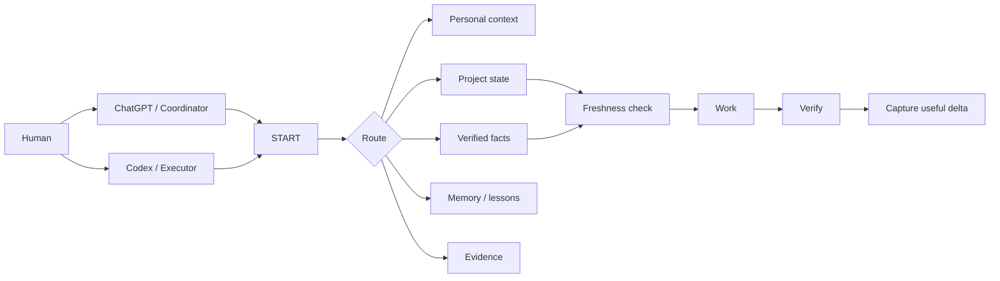

<div align="center">

# AI Continuity Kit

### A lightweight, Git-backed continuity layer for ChatGPT and Codex

**Keep useful context. Separate memory from truth. Continue projects without rebuilding everything from chat history.**

[Quick start](docs/QUICKSTART.md) · [Core model](docs/CORE_MODEL.md) · [Architecture](docs/ARCHITECTURE.md) · [Русский](README.ru.md)


</div>

---

## Why this exists

AI assistants can remember useful things, but **memory is not the same as verified truth**.

A preference can be durable. A server IP can change. A project decision can be superseded. A successful test from last month does not prove the system is healthy today.

AI Continuity Kit gives a human and their AI assistants a small shared structure for keeping those things separate.

```text
MESSAGE
  ↓
ROUTE TO THE RIGHT CONTEXT
  ↓
CHECK WHAT IS CURRENT
  ↓
WORK
  ↓
VERIFY
  ↓
SAVE ONLY THE USEFUL DELTA
```

It is intentionally **not** a database, vector store, autonomous agent platform, or transcript archive.

## The six ideas

1. **Memory is not truth.** Lessons and preferences can guide future work, but mutable facts need freshness.
2. **One fact, one owner.** Avoid multiple files that independently claim the same current state.
3. **Load only what matters.** Do not stuff every project, log, and old conversation into every prompt.
4. **Keep deltas, not transcripts.** Save decisions, verified state, blockers, and lessons—not conversational noise.
5. **Human language first.** The person should be able to ask “what is happening with my project?” without knowing the internal file layout.
6. **Technical access is not permission.** Codex or another agent having broad access does not mean every action is authorized.

## What it looks like



## Three levels of use

| Level | For | What you use |
|---|---|---|
| **Lite** | Everyday ChatGPT use | preferences + a few durable facts + memory rules |
| **Standard** | Personal/work projects | state + facts + memory + decisions + evidence |
| **Advanced** | Codex / agents / operations | permissions, action gates, recovery, CI, multiple repositories |

Start with Lite. Add structure only when a real problem requires it.

## Quick start

The ready-to-copy template lives in [`starter/`](starter/).

1. Put it in a **private** Git repository for your own data.
2. Edit `context/PREFERENCES.md` and `context/FACTS.md` conservatively.
3. Tell your AI assistant to begin with `START.md`.
4. Create a project only when something has durable state worth continuing.
5. Commit meaningful changes so you can see who changed what and recover old versions.

See the full [5-minute quick start](docs/QUICKSTART.md).

> **Privacy:** this repository is a public template. Your real personal context should normally live in a private repository. Never commit passwords, tokens, private keys, cookies, or secret-bearing configuration.

## What belongs where?

| Information | Home |
|---|---|
| “Answer me concisely, then expand if needed.” | Preferences |
| “My laptop has 32 GB RAM.” | Facts, with verification date if it may change |
| “We chose PostgreSQL for this project.” | Project decision |
| “Deployment is blocked by DNS.” | Project state |
| “Last time this error meant the service had lost its config mount.” | Memory / lesson |
| “Test passed on 2026-08-16.” | Dated evidence |
| Password / API token / private key | **Not Git** |

## What this project is not

- Not a replacement for ChatGPT Memory.
- Not a replacement for Codex project instructions.
- Not a claim that Markdown is a database.
- Not an automatic source of current runtime truth.
- Not a reason to save every conversation.
- Not an excuse to turn everyday life into process bureaucracy.

Use native assistant memory for adaptive personalization when it fits. Use this kit for **explicit, inspectable, versioned continuity**.

## Design goal

The ideal experience is boring:

> You speak normally. The assistant finds the right context, checks whether it is still trustworthy, does the work, verifies the result, and records only what will actually help next time.

## Project status

**v0.1 preview.** The core model and starter template are usable, but the project is intentionally small while real-world workflows are validated.

Planned directions include:

- lighter everyday interaction patterns;
- measurable context-budget guardrails;
- agent permission envelopes;
- optional structure validation;
- migration guides from ad-hoc prompt/memory folders.

## Independent project

AI Continuity Kit is an independent open-source project. It is not affiliated with or endorsed by OpenAI. “ChatGPT” and “Codex” are used descriptively to explain compatible workflows.

## License

MIT — see [`LICENSE`](LICENSE).
