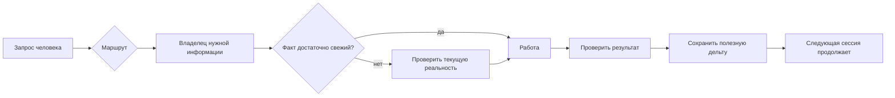

<div align="center">

# AI Continuity Kit

### Долговременная непрерывность для ChatGPT и Codex — без превращения старой памяти в текущую истину

**Лёгкий Git/Markdown-набор для людей, которым нужно продолжать работу между чатами, хранить решения и контекст, но не путать память, историю, планы и подтверждённую текущую реальность.**


</div>

## Главное за 30 секунд

| Вопрос | Ответ |
|---|---|
| **Что это?** | Публичный шаблон системы непрерывности для ChatGPT/Codex: предпочтения, факты, состояние проектов, решения, память и датированные доказательства хранятся раздельно. |
| **Зачем?** | Чтобы новый чат не начинал с нуля и при этом старый контекст не выдавался за текущую истину. |
| **Что уже есть?** | Готовый `starter/`, 5-минутный путь запуска, модель freshness/owner/evidence, примеры, FAQ, архитектура и проверенный сценарий обычного ChatGPT Web + GitHub. |
| **Что требуется для базового варианта?** | Приватный Git-репозиторий и Markdown. Отдельный API, vector database, RAG, daemon или agent framework не обязательны. |
| **Статус** | `v0.2 preview`: публичная предварительная версия. Это рабочий шаблон, но не заявленная Production-платформа. |
| **Что сейчас проверяется?** | Реальный onboarding: сможет ли новый человек понять пользу и получить первый полезный результат примерно за 5 минут — Issue #2. |
| **Что пока не доказано?** | Универсальная совместимость со всеми ChatGPT-планами/режимами, безошибочная свежесть любых внешних данных и то, что будущие v0.3-функции вообще будут нужны. |
| **Что делать владельцу/пользователю?** | Для использования — скопировать `starter/` в приватный repo. Для текущего теста проекта обязательных действий владельца нет. |

> **Главный принцип:** память полезна, но не является автоматическим источником текущей истины.

---

## Какая проблема решается

При длительной работе с ИИ обычно накапливаются четыре разных типа вещей, которые легко спутать:

- что человек предпочитает и что обычно остаётся стабильным;
- что сейчас действительно верно;
- что когда-то было верно или полезно;
- что только планируется, предполагается или требует проверки.

Без явного разделения ИИ начинает повторно спрашивать уже известное, забывает решения или, наоборот, уверенно использует устаревшие сведения.

AI Continuity Kit вводит простой рабочий цикл:

```text
ROUTE → OWNER → FRESHNESS CHECK → WORK → VERIFY → CAPTURE DELTA
```

То есть: найти правильный источник → понять, достаточно ли он свежий → выполнить работу → проверить результат → сохранить только повторно полезное изменение.

### Что меняется на практике

| До | С AI Continuity Kit |
|---|---|
| «Мы это где-то обсуждали.» | У решения есть явное долговременное место. |
| Старый факт незаметно становится «правдой». | Изменяемые факты имеют freshness/evidence boundary. |
| Каждый новый чат требует длинного пересказа. | Сессия загружает только нужный маршрут и владельца. |
| История смешивается с текущим состоянием. | `STATE`, `FACTS`, `MEMORY` и evidence выполняют разные роли. |
| Полезный проект живёт только внутри истории чата. | Продолжение хранится вне одной сессии. |
| Технический write-доступ выглядит как разрешение. | Возможность действия и полномочие действовать разделены. |

---

## Что уже реально готово

### 1. Копируемый starter

Каталог [`starter/`](starter/) содержит минимальный рабочий набор с точкой входа, контекстом и примером проекта. Его можно использовать как основу собственного приватного continuity-repository.

### 2. Быстрый старт

Есть путь первого запуска примерно за 5 минут: [`docs/QUICKSTART.md`](docs/QUICKSTART.md). Он не требует сначала изучать всю архитектуру.

### 3. Разделение типов знания

Базовая модель различает:

- **preferences** — устойчивые предпочтения;
- **facts** — подтверждённые сведения;
- **state** — текущее состояние и следующий шаг проекта;
- **memory** — полезные уроки/история, которые не получают автоматически статус CURRENT;
- **evidence** — датированные доказательства конкретной проверки;
- **permissions/gates** — что агенту реально разрешено делать.

### 4. Progressive disclosure

ИИ не должен читать весь corpus «на всякий случай». Сначала открывается точка входа, затем только нужный контекст. Это уменьшает лишний prompt-context и вероятность смешения разных проектов.

### 5. Обычный ChatGPT Web + GitHub

Практически проверен сценарий, где обычный ChatGPT с доступным GitHub App использует постоянную инструкцию на `repo/main/START.md`, входит в repository и дальше читает нужные continuity-файлы без отдельного Codex/API-runtime.

Это **field-tested compatibility**, а не универсальная гарантия: доступность GitHub App и поведение продукта могут зависеть от плана/режима и со временем меняться.

### 6. Безопасная модель действий

Наличие технического доступа не означает автоматического разрешения на широкие изменения. Advanced-путь может дополнительно вводить stop-gates, branch/PR/CI/recovery и отдельные runtime-проверки.

---

## Что сейчас НЕ готово или НЕ доказано

Проект намеренно не изображается более зрелым, чем он есть.

- `v0.2` — **preview**, не Production-сервис с SLA.
- Open Issue #2 ещё проверяет реальный первый пользовательский проход. Пока этот тест не завершён, нельзя считать 5-минутный onboarding полностью доказанным для новых пользователей.
- Поддержка обычного ChatGPT Web + GitHub подтверждена на реальном сценарии, но не обещана для каждого плана, интерфейса и будущей версии ChatGPT.
- Markdown/Git сами по себе не проверяют live-сервер, баланс, DNS, устройство или другой изменяемый внешний runtime; для таких данных нужна свежая проверка источника.
- Проект не доказывает автоматическую безошибочность ИИ. Он делает происхождение, свежесть и границы информации явными.
- Идеи v0.3 в roadmap — **кандидаты**, а не обещанные функции.
- Нет требования и цели превращать kit в автономную agent-платформу, vector database или обязательную «систему всей жизни».

---

## Текущая работа, следующий шаг и блокеры

### Главная текущая задача

Open Issue #2: **проверка 5-минутного onboarding**.

Нужный результат теста:

```text
нашёл репозиторий
→ понял, зачем он нужен
→ попробовал
→ проверил непрерывность
```

без обязательного чтения архитектурных документов до первого полезного результата.

### Следующий практический шаг проекта

Провести реальный first-use проход по README → Quickstart → `starter/BOOTSTRAP_PROMPT.md`, затем проверить, правильно ли новая сессия отличает изменённый CURRENT-факт от прежнего значения.

### Блокер

Технического blocker для source/docs сейчас не зафиксировано. Недостаёт именно **реального пользовательского evidence** по onboarding. Поэтому улучшать проект дальше только на основании вкуса или добавлять новые слои «на всякий случай» не следует.

### Что требуется от владельца

Для выполнения текущего Issue #2 — **ничего обязательного**: задача помечена как автономно проверяемая. Пользовательский отзыв полезен, но не является скрытым gate для текущей работы.

### Что владельцу делать не требуется

Не нужно:

- покупать API-кредиты;
- поднимать сервер;
- устанавливать vector database;
- держать фоновый процесс;
- переносить все старые разговоры;
- сразу заполнять десятки файлов;
- начинать с Advanced-режима.

---

## Как начать пользоваться

### Минимальный вариант

1. Скопируйте [`starter/`](starter/) в **приватный** Git-репозиторий.
2. Заполните только действительно нужное:
   - `context/PREFERENCES.md` — устойчивые предпочтения;
   - `context/FACTS.md` — факты, которые полезно повторно использовать;
   - состояние одного продолжаемого проекта — если он уже есть.
3. Используйте [`starter/BOOTSTRAP_PROMPT.md`](starter/BOOTSTRAP_PROMPT.md) либо эквивалентную инструкцию:

> Начни с `START.md`. Загружай только контекст, нужный для моего запроса. Изменяемые факты считай требующими проверки, когда актуальность важна. После существенной работы сохраняй только подтверждённую повторно полезную дельту.

4. В новой сессии задайте обычный вопрос, например: «Какое сейчас состояние проекта и что делать следующим шагом?»

### Типичный сценарий

Допустим, раньше проект использовал Провайдера A, а теперь Провайдера B.

```text
PROJECT_STATE.md   → переход завершён; сейчас Провайдер B
PROJECT_FACTS.md   → Провайдер B, last_verified = дата проверки
PROJECT_MEMORY.md  → у Провайдера A был полезный паттерн ошибки
EVIDENCE/          → результат проверки после перехода
```

Старая информация не удаляется, но она больше не может молча переопределить current state.

---

## Как всё устроено простыми словами



### Основные компоненты

| Компонент | Роль |
|---|---|
| `START.md` | стабильная точка входа новой сессии |
| контекст пользователя | предпочтения и устойчивые факты |
| project state | CURRENT-состояние, blocker, следующий шаг |
| project facts | подтверждённая фактическая основа |
| project memory | повторно полезные исторические уроки |
| evidence | датированные результаты проверок |
| Git history | происхождение и история принятых изменений |
| gates/permissions | границы разрешённых действий |

### Три уровня сложности

| Уровень | Когда нужен | Что добавляет |
|---|---|---|
| **Lite** | обычный ChatGPT | preferences, facts, memory discipline |
| **Standard** | продолжаемые проекты | state, facts, decisions, evidence |
| **Advanced** | агенты/операции | permissions, stop-gates, recovery, CI, несколько repos |

Правило проекта: **не начинать с Advanced**, если Lite/Standard уже решает реальную проблему.

---

## Где находятся данные и кто является source of truth

Сам этот GitHub repository — публичный source baseline продукта/шаблона.

После копирования starter настоящая личная система должна жить в **вашем приватном repository**. Именно там находятся ваши реальные preferences/state/facts/evidence.

Важное правило ownership:

```text
один изменяемый факт → один канонический владелец
```

История чатов, модельная Memory, backup или старый экспорт могут быть полезным evidence, но не должны одновременно становиться конкурирующими CURRENT owners.

Для внешней живой системы (сервер, DNS, устройство, API и т. п.) Git хранит accepted context, а текущая реальность подтверждается fresh runtime/read-only evidence.

---

## Конфиденциальность и безопасность

Этот repository публичный и содержит **только продуктовый шаблон**.

Для личного использования:

- храните continuity repo приватным;
- не коммитьте passwords, API tokens, private keys, cookies, session state, VPN keys, реальные `.env` secrets;
- вместо секрета храните только безопасный pointer/имя переменной;
- не публикуйте raw private chat transcripts только потому, что они когда-то использовались как источник;
- датированный PASS не выдавайте за вечный CURRENT runtime;
- model-generated command не считайте автоматически разрешённой операцией.

Подробная policy: [`SECURITY.md`](SECURITY.md).

---

## Production boundary

AI Continuity Kit — **не исполняемый Production backend**. Базовый kit — документационная/knowledge architecture поверх Git.

Поэтому:

- `README`/CI PASS доказывает только соответствующий source/documentation scope;
- он не доказывает живую работу внешнего сервиса;
- реальная destructive/privileged операция должна иметь собственное разрешение и verification;
- Advanced automation допустима, но она не превращает template в источник полномочий для чужой Production-системы.

---

## Что проверено

По текущему публичному baseline подтверждено:

- структура starter и основные документы существуют;
- базовая модель state/facts/memory/evidence сформулирована и применима как Git/Markdown workflow;
- есть воспроизводимый Quickstart и bootstrap prompt;
- ordinary ChatGPT Web + GitHub workflow был практически использован в подходящей конфигурации;
- публичный repository очищен от приватных chat transcripts и должен оставаться product-facing;
- Russian-First пользовательский слой и шаблоны Issue/PR приведены к текущему виду;
- CI проекта проверяет структурные требования репозитория.

Это не расширяется до утверждений о любом пользовательском runtime.

---

## Известные риски и технический долг

1. **Onboarding ещё требует реального evidence.** Документация может казаться понятной авторам и всё равно быть слишком тяжёлой новичку.
2. **Совместимость с AI UI изменяема.** GitHub connector/App, планы и product UX могут меняться независимо от репозитория.
3. **Freshness остаётся дисциплиной, а не магией.** Для mutable facts нужен реальный источник проверки.
4. **Дублирование owners опасно.** Копии state в нескольких местах со временем расходятся.
5. **Слишком много структуры убивает пользу.** Поэтому roadmap запрещает делать Lite тяжелее только ради новых возможностей.

---

## Ключевые решения и история развития

| Этап | Что изменилось | Почему это важно |
|---|---|---|
| `0.1.0` — 2026-08-16 | первая публичная preview, state/facts/memory, quickstart, starter, базовые gates | появилась минимальная рабочая модель |
| `0.2.0` — 2026-08-16 | входная страница и onboarding перестроены вокруг практической пользы | первый результат важнее изучения framework |
| дальнейшая product-strategy | закреплено правило «умнее, а не тяжелее» и capability-driven releases | календарь и рост количества файлов не являются целью |
| privacy hardening | публичный repo оставлен продуктовой витриной; private transcripts исключены из текущего дерева | публичный template не должен раскрывать личную историю |
| ChatGPT Web compatibility | документирован реально проверенный ordinary-chat + GitHub entrypoint | kit не требует отдельного AI-runtime для базового использования |
| Russian-First | русский README и пользовательские docs стали основным человеческим слоем | продукт должен быть понятен без англоязычного дубля |

Исторические commits/PR сохраняют provenance этих решений; README отражает только их актуальный продуктовый смысл.

---

## Куда проект развивается

Текущий принцип roadmap:

```text
больше пользы со временем
+ такой же лёгкий вход
+ такое же понятное ядро
= успешное развитие
```

Возможные v0.3-направления — initializer, автоматические structural checks, secret-publication checks, улучшенная migration guidance — остаются кандидатами до реального доказательства пользы.

Дальше могут появиться измеримые freshness/owner/context checks, но только если они не превращают Lite в тяжёлую платформу.

---

## Связь с другими подходами

AI Continuity Kit не заменяет:

- ChatGPT Memory;
- Codex/project instructions;
- Obsidian или другой second brain;
- RAG/vector databases;
- специализированный task tracker;
- backup;
- live monitoring.

Он добавляет **continuity + ownership + freshness discipline** между этими инструментами. Их можно использовать вместе.

---

## Кому проект подходит

Подходит, если вы:

- регулярно продолжаете одну работу в новых чатах;
- устали заново объяснять решения и ограничения;
- хотите различать память и current truth;
- хотите общий понятный слой между ChatGPT и Codex;
- хотите сами видеть, что ИИ считает фактом, состоянием и историческим уроком.

Скорее не нужен, если разговоры одноразовые или уже есть зрелая система, которая действительно решает freshness, ownership, continuity и action permissions.

---

## Дополнительная документация

Для **базового понимания проекта она не обязательна** — вся картина выше уже должна быть достаточной. Эти ссылки нужны для реализации и деталей:

- [Быстрый старт](docs/QUICKSTART.md)
- [ChatGPT Web + GitHub](docs/CHATGPT-WEB.md)
- [Базовая модель](docs/CORE_MODEL.md)
- [Архитектура](docs/ARCHITECTURE.md)
- [Сценарии](docs/USE_CASES.md)
- [Сравнение подходов](docs/COMPARISON.md)
- [FAQ](docs/FAQ.md)
- [Примеры](examples/README.md)
- [Дорожная карта](ROADMAP.md)
- [Безопасность](SECURITY.md)
- [Готовый starter](starter/)

<details>
<summary><strong>Короткая проверка «понимаю ли я модель»</strong></summary>

После чтения этой страницы правильная картина такая:

1. Kit не «запоминает всё» — он помогает хранить разные типы знания раздельно.
2. Старый факт не становится текущим только потому, что он есть в Memory/Git.
3. Базовый вариант — Git + Markdown + приватный repo, без обязательного backend.
4. Runtime facts перепроверяются там, где они реально живут.
5. Сложность подключается постепенно.
6. Текущий продукт — `v0.2 preview`; главный незакрытый продуктовый вопрос — реальный 5-минутный onboarding.

</details>

## Лицензия

MIT — см. [`LICENSE`](LICENSE).

Проект независимый и не аффилирован с OpenAI. Названия ChatGPT и Codex используются описательно.
