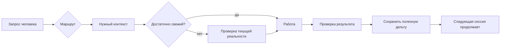

<div align="center">

# AI Continuity Kit

### Долговременная непрерывность для ChatGPT и Codex — без превращения старой памяти в текущую истину

**Лёгкий слой на Git для памяти ИИ, контекста, личных знаний и проектов, которые живут дольше одного чата.**

[Старт за 5 минут](docs/QUICKSTART.md) · [Базовая модель](docs/CORE_MODEL.md) · [Сценарии](docs/USE_CASES.md) · [Сравнение](docs/COMPARISON.md)


</div>

## Коротко

AI Continuity Kit помогает ИИ продолжать работу между чатами и при этом различать **память, историю, планы и подтверждённое текущее состояние**.

Перед действием система должна уметь ответить на три вопроса:

> **Что мы знаем? Что из этого актуально? Что мне разрешено делать?**

Для старта не нужны vector database, фоновый сервис или обязательный agent framework. Достаточно обычных Markdown-файлов и Git.

**Статус:** `v0.2 preview` — предварительная версия, которая проверяется на реальных сценариях.  
**Для реальных личных данных:** используйте приватный репозиторий.  
**Текущий быстрый путь:** [`docs/QUICKSTART.md`](docs/QUICKSTART.md).

## Какая проблема решается

При длительной работе с ChatGPT или Codex часто происходит одно и то же:

- ИИ забывает важное решение;
- помнит сведения, которые уже устарели;
- проект распадается между чатами, заметками, файлами и памятью модели;
- новая сессия заново восстанавливает контекст;
- технический доступ агента ошибочно воспринимается как разрешение менять всё.

Цель проекта — **меньше повторного восстановления, меньше устаревшего контекста и безопаснее продолжение работы**, а не больше документации ради документации.

## Что меняется для человека

| Было | С AI Continuity Kit |
|---|---|
| «Мы вроде где-то это обсуждали.» | У решений есть явное место. |
| Старая память незаметно становится «правдой». | Изменяемые факты требуют проверки свежести, когда она важна. |
| В новый чат загружается всё подряд. | ИИ читает только нужный маршрут. |
| Проект живёт внутри истории переписки. | Текущее состояние переживает отдельный чат. |
| Полезные уроки смешаны с текущими фактами. | Память и подтверждённые факты разделены. |
| Широкий доступ выглядит как широкое разрешение. | Технический доступ и полномочия разделены. |

## Один понятный пример

Допустим, проект раньше использовал Провайдера A, а затем перешёл на Провайдера B. Обычная память может продолжать предлагать Провайдера A просто потому, что эта информация раньше была важной.

В этой модели роли разделены:

```text
PROJECT_STATE.md   → миграция закончена; сейчас используется Провайдер B
PROJECT_FACTS.md   → Провайдер B, последний раз проверено 2026-08-16
PROJECT_MEMORY.md  → у Провайдера A был полезный для будущего паттерн ошибки
EVIDENCE/          → датированное доказательство теста после миграции
```

Старая информация не удаляется — ей просто **не разрешается выдавать себя за текущую реальность**.

## Старт за 5 минут

Готовый шаблон находится в [`starter/`](starter/).

1. Скопируйте `starter/` в приватный репозиторий.
2. Заполните только действительно нужные сведения:
   - `context/PREFERENCES.md` — как вам удобнее работать;
   - `context/FACTS.md` — устойчивые факты, которые стоит повторно использовать;
   - `STATE.md` одного проекта — если у вас уже есть продолжаемая работа.
3. Используйте [`starter/BOOTSTRAP_PROMPT.md`](starter/BOOTSTRAP_PROMPT.md) или дайте ИИ эквивалентную инструкцию:

> Начни с `START.md`. Загружай только контекст, нужный для моего запроса. Изменяемые факты считай требующими проверки, когда актуальность важна. После существенной работы сохраняй только подтверждённую повторно полезную дельту.

После этого можно задавать обычные вопросы, например: «Какое сейчас состояние моего проекта и что делать следующим шагом?»

> **Проверено с обычным ChatGPT в веб-версии:** в реальной конфигурации с доступным GitHub App постоянная пользовательская инструкция на `repo/main/START.md` позволяла ChatGPT входить в репозиторий, следовать маршрутам и загружать нужные continuity-файлы без Codex, ChatGPT Work и отдельного API-runtime. Доступность GitHub зависит от тарифа и режима, поэтому это подтверждённая совместимость, а не универсальная гарантия. Подробности: [`docs/CHATGPT-WEB.md`](docs/CHATGPT-WEB.md).

## Цикл непрерывности



Основное правило:

```text
ROUTE → OWNER → FRESHNESS CHECK → WORK → VERIFY → CAPTURE DELTA
```

То есть: найти правильный маршрут → определить источник истины → проверить свежесть → выполнить работу → проверить результат → сохранить только полезное изменение.

## Шесть принципов

1. **Память не является истиной.** Полезный урок может жить годами, а IP-адрес устареть завтра.
2. **Один факт — один владелец.** Несколько независимых файлов не должны одновременно заявлять разную «текущую правду».
3. **Постепенная загрузка контекста (`progressive disclosure`).** Читать только то, что действительно нужно для текущей задачи.
4. **Сохранять дельту, а не стенограмму.** Решения, проверенное состояние, блокеры и уроки — да; разговорный шум — нет.
5. **Обычный язык прежде внутренней структуры.** Человек формулирует задачу естественно, маршрутизацию выполняет ИИ.
6. **Технический доступ не равен разрешению.** Возможность записать файл ещё не означает право это делать.

## Три уровня — начинать с малого

| Уровень | Для чего | Что добавляется |
|---|---|---|
| **Lite** | Повседневный ChatGPT | предпочтения, устойчивые факты, правила памяти |
| **Standard** | Личные и рабочие проекты | состояние, факты, решения, память, датированные доказательства |
| **Advanced** | Codex / агенты / операции | разрешения, stop-gates, recovery, CI, несколько репозиториев |

`stop-gates` — условия, при которых агент обязан остановиться перед следующим действием.

Не начинайте с Advanced: дополнительная сложность оправдана только тогда, когда решает реальную повторяющуюся проблему.

## Это не просто «второй мозг»

`Second brain` обычно сосредоточен на сборе и поиске знаний. AI Continuity Kit — на **продолжении работы без смешивания памяти, истории, планов и текущей истины**.

Он может использоваться вместе с ChatGPT Memory, инструкциями Codex, Obsidian, RAG/vector database, персональным ИИ-ассистентом или обычным Git-репозиторием проекта.

Подробнее: [`docs/COMPARISON.md`](docs/COMPARISON.md).

## Где это полезно

- устойчивые предпочтения ChatGPT без превращения памяти в биографическое досье;
- проекты, которые продолжаются через десятки разговоров;
- разделение CURRENT-фактов и исторических доказательств;
- передача работы между ChatGPT и Codex;
- сохранение решений и причин, почему они были приняты;
- повторное использование полезных паттернов ошибок и восстановления;
- ограничение действий агента даже при широком техническом доступе.

Подробнее: [`docs/USE_CASES.md`](docs/USE_CASES.md).

## Конфиденциальность и безопасность

Этот репозиторий — **публичный шаблон**. Настоящий continuity-репозиторий с личным контекстом обычно должен быть **приватным**.

Никогда не помещайте в Git реальные пароли, токены, приватные ключи, cookies, session state, значения `.env` или конфигурации с секретами. Вместо значения храните безопасный указатель или имя переменной.

Датированный успешный тест доказывает состояние **в тот момент времени**, а не автоматически текущий runtime.

См. [`SECURITY.md`](SECURITY.md).

## Кому подходит проект

Проект полезен, если вы хотите, чтобы ИИ помнил, но при этом хотите понимать, почему памяти можно доверять; постоянно заново объясняете проект в новых чатах; хотите общий устойчивый контекст для ChatGPT и Codex без гигантских prompt; хотите иметь возможность самому открыть и проверить, что система считает знанием.

Он, вероятно, не нужен для разовых разговоров или если уже есть зрелая платформа, которая надёжно решает свежесть, владение источниками истины, непрерывность и права действий.

## Чем проект не является

- не замена ChatGPT Memory;
- не замена инструкциям Codex;
- не vector database и не RAG engine;
- не архив всех разговоров;
- не утверждение, что Markdown всегда должен быть базой данных;
- не повод превращать повседневную жизнь в бюрократию.

Побеждает **самая маленькая система, которая реально решает проблему**.

## Навигация

- [Быстрый старт](docs/QUICKSTART.md)
- [Обычный ChatGPT в веб-версии + GitHub](docs/CHATGPT-WEB.md)
- [Базовая модель](docs/CORE_MODEL.md)
- [Архитектура](docs/ARCHITECTURE.md)
- [Сценарии](docs/USE_CASES.md)
- [Сравнение](docs/COMPARISON.md)
- [FAQ](docs/FAQ.md)
- [Примеры](examples/README.md)
- [Дорожная карта](ROADMAP.md)
- [Готовый шаблон](starter/)

## Статус проекта

**`v0.2 preview`**. Следующая цель — не «добавить больше файлов», а сделать путь пользователя максимально коротким:

```text
Я нашёл репозиторий
        ↓
Я понял, зачем он мне
        ↓
Я получил первый полезный результат
        ↓
Я продолжаю пользоваться, потому что система уменьшает трение
```

Проект независимый и не аффилирован с OpenAI. Названия ChatGPT и Codex используются описательно.

## Лицензия

MIT — см. [`LICENSE`](LICENSE).
