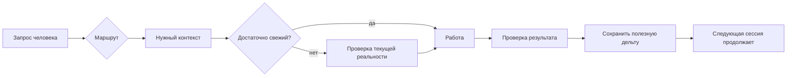

<div align="center">

# AI Continuity Kit

### Дайте ChatGPT и Codex долговременную непрерывность — не позволяя старой памяти притворяться текущей истиной.

**Лёгкий слой на Git (системе истории версий) для памяти ИИ, контекста, личных знаний и проектов, которые живут дольше одного чата.**

[⚡ Старт за 5 минут](docs/QUICKSTART.ru.md) · [🧠 Базовая модель](docs/CORE_MODEL.md) · [💡 Сценарии](docs/USE_CASES.md) · [⚖️ Сравнение](docs/COMPARISON.md) · [🇬🇧 English](README.md)


</div>

---

## Как читать технические термины

В этой русской версии точные профессиональные названия сохраняются, но при первом важном употреблении поясняются простыми словами:

- `runtime` — фактическое состояние работающей системы сейчас;
- `CURRENT` — сведения, которые считаются актуальными сейчас;
- `owner` — назначенный источник истины для конкретного вида информации;
- `evidence` — датированное доказательство или результат проверки;
- `agent` — ИИ-агент, который может читать и выполнять разрешённую работу;
- `CI` — автоматические проверки изменений;
- `recovery` — способ вернуть рабочее состояние после неудачного изменения;
- `RAG` — подход, при котором ИИ перед ответом ищет нужные материалы во внешнем хранилище;
- `vector database` — база данных, предназначенная для поиска по смысловой близости;
- `agent framework` — готовая программная основа для построения ИИ-агентов.

Имена файлов, команды, пути и другие машинные идентификаторы не переводятся: поясняется только их смысл для человека.

---

## Проблема за 20 секунд

Вы пользуетесь ChatGPT или Codex неделями и месяцами. Потом случается одно из этого:

- ИИ **забывает важное решение**;
- помнит то, что когда-то было верно, но **уже устарело**;
- проект размазан по чатам, заметкам, файлам и памяти модели;
- новая сессия снова **восстанавливает всё с нуля**;
- агент технически имеет доступ, но непонятно, **что именно ему разрешено менять**.

AI Continuity Kit даёт небольшой и понятный человеку слой продолжения работы, чтобы перед действием ИИ мог ответить на три вопроса:

> **Что мы знаем? Что из этого актуально? Что мне разрешено делать?**

Без vector database. Без фонового сервиса. Без обязательного agent framework. Начать можно с обычных `Markdown`-файлов (текстовых файлов с простой разметкой) и Git.

---

## Что меняется для человека

| Было | С AI Continuity Kit |
|---|---|
| «Мы вроде где-то это обсуждали.» | У решений есть явное место. |
| Старая память незаметно превращается в «правду». | Изменяемые факты могут требовать проверки свежести. |
| В новый чат загружается всё подряд. | ИИ читает только нужный маршрут. |
| Проект существует внутри истории переписки. | Текущее состояние переживает сам чат. |
| Полезный опыт смешан с текущими фактами. | Memory и подтверждённые факты разделены. |
| Широкий доступ агента выглядит как разрешение на всё. | Технический доступ и разрешение разделены. |

Цель — не больше документации. Цель — **меньше повторного восстановления, меньше устаревшего контекста и безопаснее продолжение работы**.

---

## Один понятный пример

Допустим, проект раньше использовал Провайдера A. Через два месяца вы перешли на Провайдера B.

Обычная память может продолжать подсовывать «Провайдер A», потому что когда-то это было важной информацией.

Здесь информация разделяется:

```text
PROJECT_STATE.md   → миграция закончена; сейчас используется Провайдер B
PROJECT_FACTS.md   → Провайдер B, последний раз проверено 2026-08-16
PROJECT_MEMORY.md  → у Провайдера A был полезный для будущего паттерн ошибки
EVIDENCE/          → датированное доказательство теста после миграции
```

Старая информация не уничтожается. Ей просто **не разрешается выдавать себя за текущую реальность**.

В этом и состоит ключевая идея проекта.

---

## Попробовать за 5 минут

Готовый шаблон находится в [`starter/`](starter/).

### 1. Скопируйте starter в приватный репозиторий

Настоящий личный контекст обычно должен оставаться приватным.

### 2. Заполните только три небольших блока

- `context/PREFERENCES.md` — как вам удобнее взаимодействовать;
- `context/FACTS.md` — устойчивые факты, которые действительно стоит повторно использовать;
- `STATE.md` одного проекта — только если у вас уже есть продолжаемая работа.

### 3. Дайте ИИ одну инструкцию

Можно использовать готовый [`starter/BOOTSTRAP_PROMPT.md`](starter/BOOTSTRAP_PROMPT.md) или просто сказать:

> Начни с `START.md`. Загружай только контекст, нужный для моего запроса. Изменяемые факты считай требующими проверки, когда актуальность важна. После существенной работы сохраняй только подтверждённую повторно полезную дельту.

После этого задайте обычный вопрос, например:

> «Какое сейчас состояние моего проекта и что мне делать следующим шагом?»

Вам **не нужно запоминать структуру файлов**. Структура существует для ИИ, чтобы он работал надёжнее.

Подробнее: [старт за 5 минут](docs/QUICKSTART.ru.md).

> [!TIP]
> **Проверено в обычном ChatGPT в веб-версии.** В реальной конфигурации, где GitHub App был доступен, постоянная Пользовательская инструкция с указанием `repo/main/START.md` позволяла обычному ChatGPT входить в репозиторий, следовать его маршрутам и загружать нужные continuity-файлы — без Codex, ChatGPT Work и отдельного API-runtime. Доступность GitHub зависит от тарифа и режима, поэтому это подтверждённая совместимость, а не гарантия для всех аккаунтов. [Точная схема настройки →](docs/CHATGPT-WEB.ru.md)

---

## Цикл непрерывности



`Mermaid` — текстовый формат диаграмм, который GitHub умеет рисовать прямо на странице.

**Основное правило:**

```text
ROUTE → OWNER → FRESHNESS CHECK → WORK → VERIFY → CAPTURE DELTA
```

То есть: найти правильный маршрут → определить источник истины → проверить свежесть → выполнить работу → проверить результат → сохранить только полезное изменение.

---

## Шесть принципов

1. **Память не является истиной.** Полезный урок может жить годами, а IP-адрес устареть завтра.
2. **Один факт — один владелец.** Не должно быть нескольких независимых файлов с разной «текущей правдой».
3. **Progressive disclosure** (постепенная загрузка контекста). Загружается только контекст, реально нужный для текущей задачи.
4. **Сохранять дельту, а не стенограмму.** Решения, проверенное состояние, блокеры и уроки — да; разговорный шум — нет.
5. **Обычный язык прежде внутренней структуры.** Человек спрашивает нормально, маршрутизацию выполняет ИИ.
6. **Технический доступ не равен разрешению.** Возможность записать файл ещё не означает разрешение это делать.

---

## Три уровня — начинайте с малого

| Уровень | Для чего | Что добавляется |
|---|---|---|
| **Lite** | Повседневный ChatGPT | предпочтения, устойчивые факты, правила памяти |
| **Standard** | Личные и рабочие проекты | state, facts, decisions, memory, датированные evidence |
| **Advanced** | Codex / агенты / операции | разрешения, stop-gates, recovery, CI, несколько репозиториев |

`stop-gates` — условия, при которых агент обязан остановиться перед следующим действием.

**Не начинайте с Advanced.** Усложнение имеет смысл только тогда, когда решает реальную повторяющуюся проблему.

---

## Это ещё один «second brain»?

Не совсем.

`Second brain` («второй мозг») обычно сосредоточен на **сборе и поиске знаний**. AI Continuity Kit сосредоточен на **продолжении работы без смешивания памяти, истории, планов и текущей истины**.

Он может использоваться вместе с:

- ChatGPT Memory;
- инструкциями Codex;
- Obsidian;
- RAG/vector database;
- персональным AI-ассистентом;
- обычным проектным Git-репозиторием.

См. [сравнение подходов](docs/COMPARISON.md).

---

## Где это полезно

- устойчивые предпочтения ChatGPT без превращения памяти в биографическое досье;
- проект, который продолжается через десятки разговоров;
- разделение CURRENT-фактов и исторических доказательств;
- передача работы между ChatGPT и Codex;
- сохранение решений и причин, почему они были приняты;
- повторное использование полезных паттернов ошибок и восстановления;
- ограничение действий агента, даже когда технически у него широкий доступ.

См. [реалистичные сценарии](docs/USE_CASES.md).

---

## Конфиденциальность и безопасность

Этот репозиторий — **публичный шаблон**. Ваш настоящий continuity-репозиторий обычно должен быть **приватным**.

Никогда не помещайте в Git реальные пароли, токены, приватные ключи, `cookies` (данные браузерной сессии), `session state` (состояние пользовательской сессии), `.env` (файл переменных окружения) и конфигурации с секретами. Вместо значения можно хранить безопасный указатель или имя переменной.

И ещё: датированный успешный тест доказывает состояние **в тот момент времени**. Он не доказывает автоматически текущее состояние работающей системы.

См. [`SECURITY.md`](SECURITY.md).

---

## Кому это подходит

Проект полезен, если вы думаете:

- «Я хочу, чтобы ИИ помнил, но хочу понимать, **почему этой памяти можно доверять**.»
- «Я постоянно заново объясняю проект в новых чатах.»
- «Я хочу, чтобы ChatGPT и Codex использовали устойчивый общий контекст, но не загружали всё подряд.»
- «Я хочу иметь возможность самому открыть и понять, что именно ИИ считает знанием.»

Скорее всего проект вам не нужен, если вы используете ИИ только для разовых разговоров или уже имеете зрелую систему, которая решает freshness (свежесть данных), ownership (владение источником истины), continuity (непрерывность между сессиями) и permissions (разрешения на действия).

---

## Чем проект не является

- Не замена ChatGPT Memory.
- Не замена инструкциям Codex.
- Не vector database и не `RAG engine` (система, которая подбирает внешние материалы перед ответом ИИ).
- Не архив всех разговоров.
- Не утверждение, что Markdown всегда должен быть базой данных.
- Не повод превращать повседневную жизнь в бюрократию.

Побеждает **самая маленькая система, которая реально решает проблему**.

---

## Что посмотреть дальше

- [Быстрый старт](docs/QUICKSTART.ru.md)
- [Обычный ChatGPT в веб-версии + GitHub](docs/CHATGPT-WEB.ru.md)
- [Core model](docs/CORE_MODEL.md)
- [Architecture](docs/ARCHITECTURE.md)
- [Сценарии](docs/USE_CASES.md)
- [Сравнение](docs/COMPARISON.md)
- [FAQ](docs/FAQ.md)
- [Примеры](examples/README.md)
- [Roadmap](ROADMAP.md)
- [Starter](starter/)

---

## Статус проекта

**v0.2 preview** (предварительная версия для проверки на реальных сценариях). Модель намеренно остаётся лёгкой.

Следующая цель — не «добавить больше файлов», а сделать путь таким:

```text
Я только что нашёл репозиторий
        ↓
Я понял, зачем он мне
        ↓
Я получил первый полезный результат
        ↓
Я продолжаю пользоваться, потому что система уменьшает трение
```

Проект независимый и не аффилирован с OpenAI. Названия ChatGPT и Codex используются описательно.

## Лицензия

MIT — см. [`LICENSE`](LICENSE).
