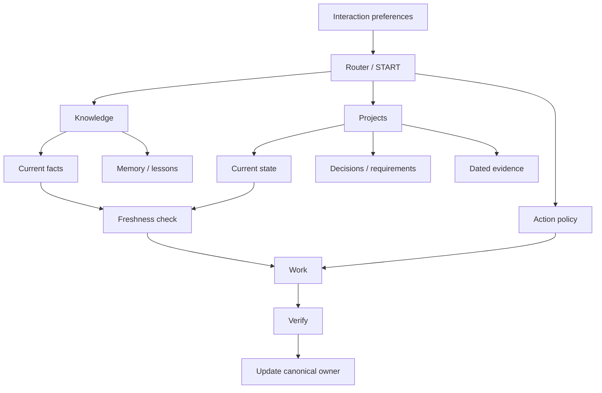

# Architecture

AI Continuity Kit separates five concerns that are often mixed together.



## Interaction layer

How the assistant should communicate and personalize presentation. It should not silently rewrite factual truth to match preferences.

## Knowledge layer

Durable facts, decisions, lessons, and evidence. The key rule is to keep *current facts* separate from *memory*.

## Project layer

A project has a compact current state so a new session can resume without reading the full history.

## Action layer

For Codex or another agent, distinguish autonomy from permission. An agent may be free to investigate while still being read-only.

## Evidence layer

Tests and observations are dated. Old evidence remains useful history, but does not automatically prove the current state.

## Progressive disclosure

A good startup path is small:

```text
START
→ classify the request
→ load only relevant context
→ work
```

Large histories, logs, and evidence should be loaded only when the current task needs them.
