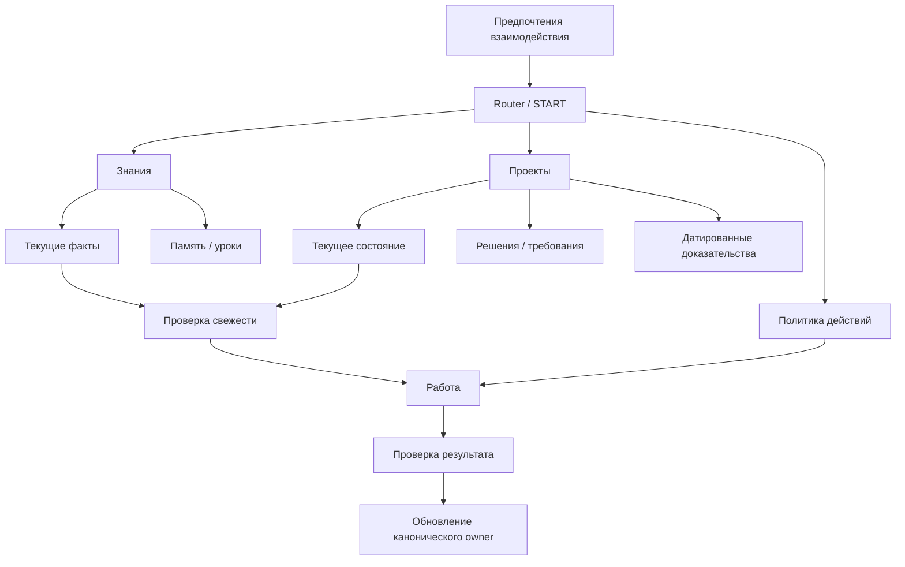

# Архитектура

AI Continuity Kit разделяет пять областей, которые часто ошибочно смешивают.



## Слой взаимодействия

Определяет, как ассистент должен общаться и адаптировать подачу. Предпочтения не должны незаметно переписывать фактическую истину.

## Слой знаний

Устойчивые факты, решения, уроки и доказательства. Ключевое правило — хранить **текущие факты** отдельно от **памяти**.

## Слой проектов

У проекта есть компактное текущее состояние, чтобы новая сессия могла продолжить работу без чтения всей истории.

## Слой действий

Для Codex или другого агента автономность отделяется от разрешений. Агент может свободно исследовать, оставаясь при этом в режиме read-only.

## Слой доказательств

Тесты и наблюдения датируются. Старое evidence остаётся полезной историей, но не доказывает автоматически текущее состояние.

## Постепенная загрузка контекста

Хороший стартовый путь должен быть коротким:

```text
START
→ классифицировать запрос
→ загрузить только нужный контекст
→ выполнить работу
```

Большие истории, логи и доказательства загружаются только тогда, когда они действительно нужны текущей задаче.
